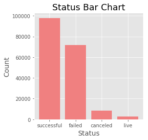

# Kickstarting Your Project

## Table of Contents
- [Background](#Background)
- [Project Goal](#project-goal)
- [Data](#the-data)
- [Exploratory Data Analysis](#exploratory-data-analysis)
- [Modeling](#modeling)
- [Natural Language Processing (NLP)](#natural-language-processing-nlp)
- [Hyperparameters and Feature Importance](#hyperparameters-and-feature-importance)
- [LSTM Networks](#lstm-networks)
- [Conclusion](#conclusion)

---

## Background 

Kickstarter is a crowdfunding platform with a stated mission to "bring creative projects to life". Since its launch in 2009, it has attracted artists, designers, musicians, and creative people from all over the world to pitch their project ideas to the public in hopes to make their vision a reality. According to [Kickstarter](https://www.kickstarter.com/charter?ref=how_it_works), there have been more than 17 million people pledging a total of more than $4 billion to fund 445,000 projects. These projects include films, music, stage shows, comics, video games, technology, design, food, and arts and crafts. 

---

## Project Goal

One would wonder what makes a kickstarter campaign successful. Let's wonder no more. We are going to use machine learning models to predict whether a campaign will meet its funding goal within 90 days of launched date. Hence to answer the question, "what can you leverage to make your campaign successful?"

---

## The Data

I'm using three different sets of data for this project: basic information for ~204,000 Kickstarter campaigns, backers' comments, and comments with sentiment analysis. The Kickstarter dataset that contain detailed information about each campaign is downloadable. Comments with sentiment analysis can be found on Kaggle, and lastly, I scraped the Kickstarter comments manually. 

The downloadable datasets have a total of 55 csv files that contain campaigns starting from April of 2009 up until April of 2020. I started with 204,625 rows and 38 columns of data; after removing duplicate entries, cancelled and live campaigns, irrelevant features, and campaigns with a length of more than 90 days, I was left with 169,591 datapoints to work with. 

The columns that I kept are:
- Backers Count (number of backers per campaign)
- Blurb (Brief description of the campaign)
- Profile 
- Country
- Deadline
- Goal
- Launched at
- Name 
- Pledged (funds raised)
- Slug
- Staff Pick
- State (successful or failed)

From these features, I was able to perform feature engineering to extract the following features:
- Launch month
- Launch year
- Category Type
- Campaign length
- Blurb length

Because there is AJAX on their site. I had to use Pypeteer instead of BeautifulSoup to scrape their comments page. For that reason, I was only able to scrape 26,779 campaigns for their comments and dates. 

---

## Exploratory Data Analysis

### An overview of data

Number of projects launched from 2009 to 2020 plot in a time series graph. There was a peak between 2014 and 2015, and then we're starting to see a trend of a decrease in volume around December of each year starting 2014.

Of all the campaigns that were launched at Kickstarter, 54% of them are successful and 40% of them have failed. The vast majority were launched in the US, with a total of 119,325 campaigns! Followed by the UK, with a total of 18,833 campaigns. 

    

### How do campaigns vary by categories?

The five most common type of campaigns listed on Kickstarter are film & videos, music, technology, publishing and art. However, campaigns that are design related attract the most generous backers, followed by technology.

### How do features vary between successful campaigns and failed campaigns?

The median goal for failed campaigns are roughly $7,500 while successful campaigns have a median goal of $3,500. Unsurprisingly, lower goal tend to yield a successful campaign. As for campaign length, longer does not necessary attract more backers. The median campaign length for successful campaigns are around 30 days, versus failed campaigns have a slightly longer length. And lastly, majority of the campaigns that are staff picked end up to be successful campaigns. 

### How do campaigns do in general by year?

Most campaigns launched between 2010 until the end of of 2013 were able to raised enough funds to meet their goal by deadline. That trend disappeared from 2014 to 2018, and then there was huge spike of successful campaigns in 2019. 

---

## Modeling

After doing one hot encoding to all categorical features, I was ready to split the data into training set and testing set, and train them with machine learning models. The three models that I did as my baseline models are logistic regression, random forest classifier, and gradient boost classifier. 

### Logistic Regression
- **Accuracy:** 0.627
- **Cross val score:** 0.623
- **Confusion Matrix:**
     | 21,848   | 2663  | 
    | :-------- | :------: | 
    | **13,206** | **4,681**| 

### Random Forest Classifier
- **Accuracy:** 0.715
- **Cross val score:** 0.714
- **Confusion Matrix:**
     | 18,001    | 6510   | 
    | :-------- | :------: | 
    | **5,529** | **12,358**| 

### Gradient Boost Classifier
- **Accuracy:** 0.742
- **Cross val score:** 0.738
- **Confusion Matrix:** 

    | 20,133    | 4,378   | 
    | :-------- | :------: | 
    | **6,573** | **11,314**| 

Because my data is balanced, the accuracy score would be a metric I want to use to evaluate how accurate my model is. The accuracy score is the ratio of number of correct predictions to the total number of input samples. In combination with the cross val score and the confusion matrix, I am confident to select gradient boost classifier as the best machine learning model I can use for this prediction. 

Let's evaluate it further by looking at the ROC curve. The ROC curve also shows that gradient boost classifier performs the best out of all three models.

## Natural Language Processing (NLP)

Sentiment analysis is a sub-field of natural language processing that tries to identify and extract opinions by gauging the attitude, sentiments, and emotions of a writer through texts. I have decided to use the VADER sentiment analysis from the nltk library in python to evaluate the blurb feature, which is the headline to a campaign, to see if I can improve my model using sentiment analysis. 

The VADER analyzer algorithem outputs sentiment scores to 4 classes of sentiments: negative, neutral, positive, and compound, which is the aggregated score of the other three sentiments. 

After adding the 4 classes of sentiment scores to my features, I fit my training data into my three models and find that adding sentiment analysis did not make an impact to my models. 

## Hyperparameters and Feature Importance

Next, I wanted to tune my hypyerparameters by running grid search. After putting my machine to work for 2 hours, grid search returned the most optimal hyperparameters for my gradient boost classifier model:

- **Learning rate:** 0.1
- **Max Depth:** 6
- **Min Sample Leaf:** 2
- **Max Features:** 1
- **N_estimators:** 500
- **random_state:** 1

### Feature Importance 

I also looked into feature importance to identify what are some of the most impactful features to the dependent variable. These did not come to a surprise as they reaffirm some of the analysis I did in my EDA.

## LSTM Networks

After achieving 75% accuracy in predicting success using basic campaign information, I wanted to know if evaluating mid-campaign comments will improve my model. Out of the 26,779 scraped campaigns, there are 8,001 campaigns with mid-campaign comments in which I can add to my model as an added feature. I set the mid-campaign date as 15 days after its launch day, all comments left before the mid-campaign dates are comments that will be evaluated. As shown in the graph below, majority of the campaigns (18,778) do not have mid-campaign comments. But out of the 8,001 campaigns with mid-campaign comments, 80% of them were successful.

Because I did not have enough data to train my LSTM model, I used a dataset that I found on Kaggle to train my LSTM model. 

## Evaluation

To compare apples to apples, I first ran my Gradient Boost model with the 26,779 scraped campaigns to see how they do. Then I added a new categorical feature for campaigns with mid-campaign comments as 1, those without as 0. Then I added an additional campaign length feature as the number of mid_campaign comments. Here are the accuracy results: 

**No added comment feature:** 80.5%

**With catorical mid-campaign comments as feature:** 81.5%

**With mid-campaign comments and length of comments:** 81.2%

### LSTM on Sentiment Analysis

I trained my LSTM model with 80,000 short phrases of Kickstarter comments. I split the data between training set and testing set, train a few models with different parameters, and the following parameters gave me the best result:

Number of keywords: 150
Maxmium words per comment: 50
Embedding Dimension: 100
Dropout = 0.2

Total of 5 layers with 1 embedding, 2 LSTM, 1 dropout and 1 dense.

Training accuracy: 78%
Test accuracy: 70%

With my LSTM model and sentiment analysis as an added feature, I was able to achieve 83.4% using Random Forest.

## Conclusion

To conclude, here are some of the suggestions for a successful campaign on Kickstarter:
- **Goal:** Have a reasonable funding goal.
- **Staff Pick:** Staff pick campaigns get prime placement on the Kickstarter's website and they appear in Kickstarter's widely-distributed email. It would only make sense that being featured on "Projects We Love" by Kickstarter would help with meeting your project goal.
- **Campaign Length:** Keep your campaign length to 30 days. 

When predicting all 170,000 Kickstarter campaigns, I am able to use machine learning to predict, with **75.1%** accurancy, whether a Kickstarter campaign would meet its funding goal within 60 days of its launch. 

Once I added the comment feature into my model, I was able to improve my model by approximately 3%. I believe I continue to tweek my model, and if I have more data points to work with, I will be able to provide a more prominant result on how sentiment analysis can impact a model.
 

