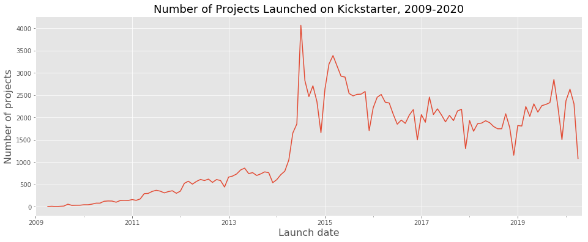
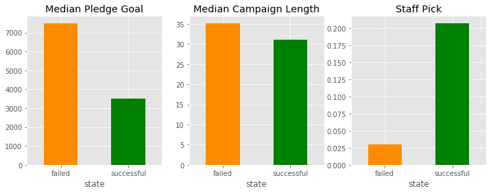

# Kickstarting Your Project

## Table of Contents
- [Background](#Background)
- [Project Goal](#project-goal)
- [Data](#the-data)
- [Exploratory Data Analysis](#exploratory-data-analysis)
- [Modeling](#modeling)
- [Conclusion](#conclusion)

---

## Background 

Kickstarter is a crowdfunding platform with a stated mission to "bring creative projects to life". Since its launch in 20019, it has attracted artists, designers, musicians, and creative people from all over the world to pitch their project ideas to the public in hopes to make their vision a reality. According to [Kickstarter](https://www.kickstarter.com/charter?ref=how_it_works), there have been more than 17 million people pledging a total of more than $4 billion to fund 445,000 projects. These projects include films, music, stage shows, comics, video games, technology, design, food and arts and crafts. 

---

## Project Goal

One would wonder what makes a kickstarter campaign successful. Let's wonder no more. We are going to use machine learning models to predict whether a campaign will meet its funding goal within 90 days of launched date. Hence to answer the question, "what can you leverage to make your campaign successful?"

---

## The Data

There are downloadable Kickstarter datasets that are being scraped monthly. The datasets I use have a total of 55 csv files that contain campaigns starting from April of 2009 up until April of 2020. I started with 204,625 rows and 38 columns of data; after removing duplicate entries, cancelled and live campaigns, irrelevant features, and campaigns with a length of more than 90 days, I was left with 169,591 datapoints to work with. 

The columns that I kept are:
- Backers Count (number of backers per campaign)
- Blurb (Brief description of the campaign)
- Profile 
- Country
- Deadline
- Goal
- Launched at
- Name 
- Pledged (funds raised)
- Slug
- Staff Pick
- State (successful or failed)

From these features, I was able to perform featuring to extract the following features:
- Launch month
- Launch year
- Category Type
- Campaign length
- Blurb length

---

## Exploratory Data Analysis

**An overview of data**

Number of projects launched from 2009 to 2020 plot in a time series graph. There is a between between 2014 and 2015, and then we're starting to see a trend of a decrease in volumne around December of each year.

Of all the campaigns that were launched at Kickstarter, 54% of them are successful and 40% of them have failed. With the vast majority launched in the US, a total of 119,325 campaigns! Followed by the UK, with a total of 18,833 campaigns. 

 

**How do campaigns vary by categories?**

The five most common type of campaigns listed on Kickstarter are film & videos, music, technology, publishing and art. However, campaigns that are design related attract the most generous backers, followed by technology.

**How do features vary between successful campaigns and failed campaigns?**

The median goal for failed campaigns roughly $7,500 while successful campaigns have a median goal of $3,500. Unsurprisingly, lower goal tend to yield a successful campaign. As for campaign length, longer does not necessary attract more backers. The median campaign length for successful campaigns are around 30 days, versus failed campaigns have a slightly longer length. And lastly, majority of the campaigns that are staff picked end up to be successful campaigns. 

**How do campaigns do in general by year?**

Most campaigns launched between 2010 and end of 2013 were able to raised enough funds to meet their goal by deadline. That trend disappeared from 2014 to 2018, and then there was huge spike of successful campaigns in 2019. 

---

# Modeling

After doing one hot encoding to all categorical features, I was ready to split the data into training set and testing set, and train them with machine learning models. The three models that I did my baseline models are logistic regression, random forest classifier, and gradient boost classifier. 

### Logistic Regression
- **Accuracy:** 0.627
- **Cross val score:** 0.623

### Random Forest Classifier
- **Accuracy:** 0.715
- **Cross val score:** 0.714

### Gradient Boost Classifier
- **Accuracy:** 0.742
- **Cross val score:** 0.738
- **Confusion Matrix:** | 20,133 | 4,378 |
                        | 6,573  | 11,314|
                        

According to my findings, we can see that the Welch's t-test statistics is 2.34. The probability of having this result, or more extreme, given the null hypothesis is true is 0.0099. This is statistically signficiant enough for us to reject the null hypothesis. Airbnb listings in Noe Valley are generally more expensive than Mission.

### Mann-Whitney U-test
I also performend a Mann-Whitney U-test with  similar result with a p-value of 0.016. Noe Valley is clearly more expensive than Mission.

## Inner Sunset vs. Outer Sunset

- Inner Sunset 
    - Avg price: $230.24
    - Count: 161

- Outer Sunset
    - Avg price: $153.97
    - Count: 277

Here is the distribution of listing price between the two neighborhoods.

One tail hypothesis test varialbes:
- **Null Hypothesis:** Inner Sunset is more expensive than Outer Sunset by chance.
- **Alternative Hypothesis:** Inner Sunset is truly more expensive than Outer Sunset. 
- **Alpha Level:** 0.05
- **Welch Test Statistics:** 2.95
- **Degrees of Freedom:** 281.25
- **p-value:** 0.0017

According to my findings, we can see that the Welch's t-test statistics is 2.95. The probability of having this result, or more extreme, given the null hypothesis is true is 0.0017. This is statistically signficiant enough for us to reject the null hypothesis. Airbnb listings in Inner Sunset are generally more expensive than Outer Sunset.

### Mann-Whitney U-test
 The Mann-Whitney U-test with similar result with a p-value of 0.0000. Inner Sunset is clearly more expensive than Outer Sunset.

# Conclusion

When I ran my hypothesis testing, my Welch's t-tests were returning different results from my Mann-Whitney U-tests. Reason being there are a couple of outliers in the neighborhoods with prices listed for more than $2,000 a night. As Welch's t-tests are sensitive to standard deviations, I removed all listing prices of more than $2,000 and they gave me similar results to my Mann-Whitney U-test. 

In conlusion, both Welch's t-tests and Mann-Whitney U Tests return statistically significant results to indicate Airbnb listing prices do vary by neighborhoods in San Francisco, even if they are in close proximity. If an investor wants to purchase a property in San Francisco for listing in Airbnb, the location of the property is a good indicator of how much to charge for the listing. 

 

